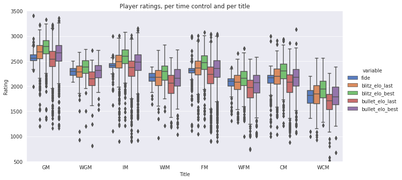
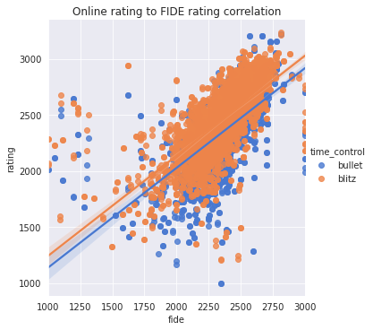

# Chess data analysis

### [Home](https://morgant-ds.github.io) > [Projects](https://morgant-ds.github.io/data-science-projects) 
-------------------------------
This page presents the story of this data science project without delving deep in details. Please keep reading for an overview of the methodology and results of this study, or head over to the below links for a more in-depth look.

[Do online and official ratings correlate well?](chess-data-analysis/chess-ratings-correlation.md)

[Evaluating chess openings - Finishing our dataset](chess-data-analysis/data-chess-openings-graph-sampling.md)

[Evaluating chess openings - Analysis](chess-data-analysis/data-chess-openings-graph-analysis.md)

-------------------------------

# Do online and official ratings correlate well?

A question often asked on chess forums is if it is possible to predict how much they could officially be rated given their online rating. The common answer is "Not really, but from this website you should remove XXX ELO and from this one YYY". In this section I'll try to simply observe if this kind of answer can be backed up by data somehow.

In order to only get online chess players for whom I have a reliable official rating to compare to, I chose to work through chess.com's API and with titled players. It is difficult to get reliable official ratings for non-titled usernames, but if I can't get any reasonable correlation with titled players there is no need to gather the data from non-titled as their ratings are typically much more volatile since many of these players are typically in the population range of improving players, meaning unaccurate ratings.

Our initial dataset - a list of titled players registered on chess.com - had many problems with its entries. I decided to remove the data about *Rapid* time controls, since less than 10% of the players played at least 100 games. I also had quite a bit of corrupted data in the FIDE rating column which was simply replaced by NaN, effectively relabelling them as missing data. The missing fide ratings were kept as is, since I want to analyze the correlation between this feature and other things I felt it was important to not replace these missing values arbitrarily and potentially affect our results. I also had inactive players, which were simply deleted as they will not be useful for answering either our current question or the next ones.

Interestingly, we notice that the average ratings per title are actually nicely ordered.  

Unfortunately, it seems that our dots are all over the place. I tried a simple linear regression on this data, and although it shows correlation, I found a standard deviation of around 150 fide rating when using it as a prediction tool which is way too high if we want to use such a model to make any predictions, especially with the hypothesis that this data should be much less volatile for titled players than for non-titled players. This hypothesis is based off two reasons:  

- The lower the rating of a player, the more likely it is that this player is still improving, thus increasing the volatility of his results.  

- The better a player, the more consistent his play will be. A more consistent quality of play will lead to more consistent results, and since consistency in results should translate directly in more consistent ratings, their ratings should also display less variance.  

There is not much point in trying other fitting models to this data: **the dispersion in ratings is just too high to get a good precision**, as seen in the following figure:  

I am now fairly confident to say that one cannot predict a potential FIDE rating from his online ratings. Well, one can, but the range is just too large for that prediction to be useful.

## Which chess openings are best for beginners? Grandmasters?

*Link to Hikaru Nakamura's video series about chess opening tier lists + introduction comments*

### Completing the dataset: Graph Sampling.

### A data scientist's chess opening tier list!
