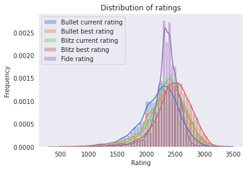
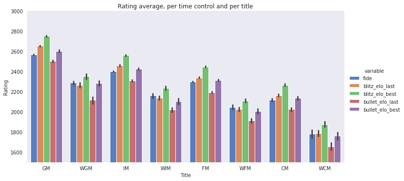
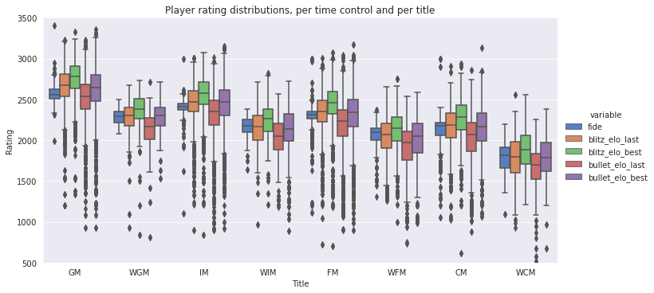
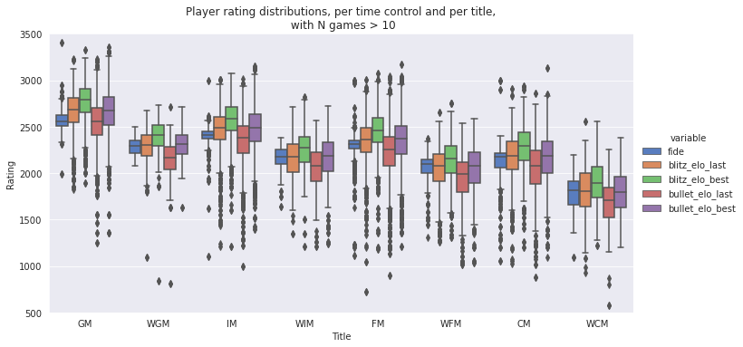
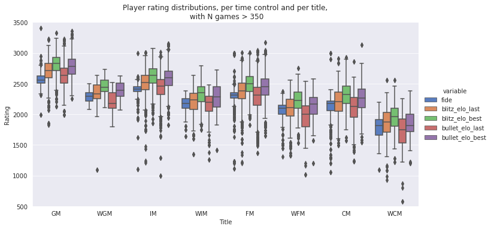
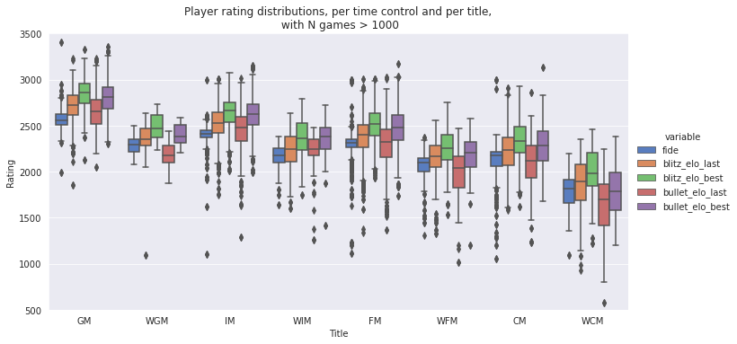
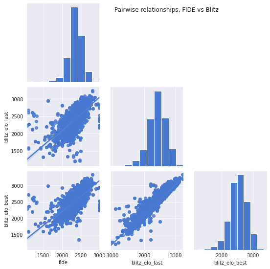
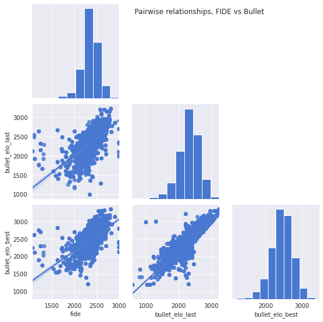

# Analysis and cleaning of our initial dataset

## Importing back our data


```python
import mysql.connector
import numpy as np
import pandas as pd
import matplotlib.pyplot as plt
%matplotlib inline
import seaborn as sns
sns.set_palette(sns.color_palette('muted'))

def sql_connect():
    #Create connection to the database
    try:
        conn = mysql.connector.connect(host='localhost',
                                      database = 'chess_project',
                                      user = 'dfuu',
                                      password = 'p@s8my_SQL')
        cursor = conn.cursor()
    except:
        print("Couldn't connect to database")
        raise
    return conn, cursor

def sql_dc(co, cu):
    cu.close()
    co.close()
    return

conn, cursor = sql_connect()
df = pd.read_sql('SELECT * FROM Players', con = conn)
sql_dc(conn, cursor)
```

## Initial data exploration

blablabla


```python
df.head()
```


<div>
<style scoped>
    .dataframe tbody tr th:only-of-type {
        vertical-align: middle;
    }

    .dataframe tbody tr th {
        vertical-align: top;
    }

    .dataframe thead th {
        text-align: right;
    }
</style>
<table border="1" class="dataframe">
  <thead>
    <tr style="text-align: right;">
      <th></th>
      <th>player_id</th>
      <th>player_name</th>
      <th>title</th>
      <th>fide</th>
      <th>rapid_elo_last</th>
      <th>rapid_elo_best</th>
      <th>rapid_n_games</th>
      <th>blitz_elo_last</th>
      <th>blitz_elo_best</th>
      <th>blitz_n_games</th>
      <th>bullet_elo_last</th>
      <th>bullet_elo_best</th>
      <th>bullet_n_games</th>
      <th>last_updated</th>
      <th>archives</th>
    </tr>
  </thead>
  <tbody>
    <tr>
      <th>0</th>
      <td>1252</td>
      <td>124chess</td>
      <td>GM</td>
      <td>NaN</td>
      <td>2294.0</td>
      <td>2350.0</td>
      <td>7.0</td>
      <td>2662.0</td>
      <td>2830.0</td>
      <td>2308.0</td>
      <td>2419.0</td>
      <td>2605.0</td>
      <td>142.0</td>
      <td>202008</td>
      <td>['/202008', '/202007', '/202006', '/202005', '...</td>
    </tr>
    <tr>
      <th>1</th>
      <td>1253</td>
      <td>1977ivan</td>
      <td>GM</td>
      <td>2641.0</td>
      <td>2423.0</td>
      <td>2556.0</td>
      <td>6.0</td>
      <td>2683.0</td>
      <td>2798.0</td>
      <td>456.0</td>
      <td>2500.0</td>
      <td>2075.0</td>
      <td>2.0</td>
      <td>202008</td>
      <td>['/202008', '/202007', '/202006', '/202005', '...</td>
    </tr>
    <tr>
      <th>2</th>
      <td>1254</td>
      <td>1stsecond</td>
      <td>GM</td>
      <td>2582.0</td>
      <td>2413.0</td>
      <td>2608.0</td>
      <td>14.0</td>
      <td>2789.0</td>
      <td>2932.0</td>
      <td>10035.0</td>
      <td>2654.0</td>
      <td>2872.0</td>
      <td>1901.0</td>
      <td>202008</td>
      <td>['/202008', '/202007', '/202006', '/202005', '...</td>
    </tr>
    <tr>
      <th>3</th>
      <td>1255</td>
      <td>2nd_life</td>
      <td>GM</td>
      <td>2450.0</td>
      <td>NaN</td>
      <td>NaN</td>
      <td>NaN</td>
      <td>2508.0</td>
      <td>2593.0</td>
      <td>4112.0</td>
      <td>2304.0</td>
      <td>2382.0</td>
      <td>489.0</td>
      <td>202008</td>
      <td>['/202008', '/202007', '/202006', '/202005', '...</td>
    </tr>
    <tr>
      <th>4</th>
      <td>1256</td>
      <td>2vladimirovich90</td>
      <td>GM</td>
      <td>2727.0</td>
      <td>NaN</td>
      <td>NaN</td>
      <td>NaN</td>
      <td>2984.0</td>
      <td>3084.0</td>
      <td>1722.0</td>
      <td>3155.0</td>
      <td>3157.0</td>
      <td>601.0</td>
      <td>202008</td>
      <td>['/202008', '/202007', '/202006', '/202005', '...</td>
    </tr>
  </tbody>
</table>
</div>


```python
df.describe()
```


<div>
<style scoped>
    .dataframe tbody tr th:only-of-type {
        vertical-align: middle;
    }

    .dataframe tbody tr th {
        vertical-align: top;
    }

    .dataframe thead th {
        text-align: right;
    }
</style>
<table border="1" class="dataframe">
  <thead>
    <tr style="text-align: right;">
      <th></th>
      <th>player_id</th>
      <th>fide</th>
      <th>rapid_elo_last</th>
      <th>rapid_elo_best</th>
      <th>rapid_n_games</th>
      <th>blitz_elo_last</th>
      <th>blitz_elo_best</th>
      <th>blitz_n_games</th>
      <th>bullet_elo_last</th>
      <th>bullet_elo_best</th>
      <th>bullet_n_games</th>
    </tr>
  </thead>
  <tbody>
    <tr>
      <th>count</th>
      <td>15569.000000</td>
      <td>8927.000000</td>
      <td>9013.000000</td>
      <td>8273.000000</td>
      <td>9013.000000</td>
      <td>14611.00000</td>
      <td>14521.000000</td>
      <td>14611.000000</td>
      <td>12054.000000</td>
      <td>11628.000000</td>
      <td>12054.000000</td>
    </tr>
    <tr>
      <th>mean</th>
      <td>9036.000000</td>
      <td>1642.378515</td>
      <td>2066.778320</td>
      <td>2178.163302</td>
      <td>48.842117</td>
      <td>2367.40271</td>
      <td>2468.536809</td>
      <td>2280.048046</td>
      <td>2223.318566</td>
      <td>2337.937221</td>
      <td>1457.044052</td>
    </tr>
    <tr>
      <th>std</th>
      <td>4494.527506</td>
      <td>1092.500734</td>
      <td>335.725245</td>
      <td>332.428130</td>
      <td>334.907275</td>
      <td>306.46181</td>
      <td>308.642739</td>
      <td>4670.457208</td>
      <td>341.448945</td>
      <td>350.524602</td>
      <td>4528.794197</td>
    </tr>
    <tr>
      <th>min</th>
      <td>1252.000000</td>
      <td>0.000000</td>
      <td>400.000000</td>
      <td>819.000000</td>
      <td>1.000000</td>
      <td>415.00000</td>
      <td>613.000000</td>
      <td>1.000000</td>
      <td>513.000000</td>
      <td>673.000000</td>
      <td>1.000000</td>
    </tr>
    <tr>
      <th>25%</th>
      <td>5144.000000</td>
      <td>0.000000</td>
      <td>1863.000000</td>
      <td>2000.000000</td>
      <td>4.000000</td>
      <td>2200.00000</td>
      <td>2302.000000</td>
      <td>178.000000</td>
      <td>2029.000000</td>
      <td>2137.000000</td>
      <td>36.000000</td>
    </tr>
    <tr>
      <th>50%</th>
      <td>9036.000000</td>
      <td>2281.000000</td>
      <td>2090.000000</td>
      <td>2200.000000</td>
      <td>10.000000</td>
      <td>2394.00000</td>
      <td>2494.000000</td>
      <td>742.000000</td>
      <td>2259.000000</td>
      <td>2376.000000</td>
      <td>212.000000</td>
    </tr>
    <tr>
      <th>75%</th>
      <td>12928.000000</td>
      <td>2417.000000</td>
      <td>2300.000000</td>
      <td>2409.000000</td>
      <td>25.000000</td>
      <td>2571.00000</td>
      <td>2677.000000</td>
      <td>2422.500000</td>
      <td>2450.000000</td>
      <td>2566.000000</td>
      <td>1015.000000</td>
    </tr>
    <tr>
      <th>max</th>
      <td>16820.000000</td>
      <td>3411.000000</td>
      <td>2960.000000</td>
      <td>3045.000000</td>
      <td>16493.000000</td>
      <td>3234.00000</td>
      <td>3332.000000</td>
      <td>79270.000000</td>
      <td>3231.000000</td>
      <td>3357.000000</td>
      <td>97547.000000</td>
    </tr>
  </tbody>
</table>
</div>


From here, we can first observe quite a bit of NaN values already in the first rows. A quick look at the *df.describe()* result shows that we are missing quite a fit of fide ratings, and that a lot of players actually don't play rapid.

We also notice that the minimum values for the elos don't make much sense for players of this caliber. It's likely due to either inactivity or too few games played in these time controls.

The first step that will be taken will be to consider every timecontrol with too few games as inexistant. Volatility is too high in these cases and we have no reason to deal with such outliers. It's quite obvious that no titled player can have a 400 or 800 rating in rapid, 513 in blitz...etc... (as a baseline, if you didn't knew chess and wanted to start now, you'd be starting with 800-1000 rating right away).


```python
print('Number of players with less than 100 rapid games:', len(df[df.rapid_n_games < 100]))
print('Number of players with less than 100 blitz games:', len(df[df.blitz_n_games < 100]))
print('Number of players with less than 100 bullet games:', len(df[df.bullet_n_games < 100]))
```

    Number of players with less than 100 rapid games: 8446
    Number of players with less than 100 blitz games: 2662
    Number of players with less than 100 bullet games: 4588


For blitz, we can see that we have a good percentage of people who have played 100 games or more. Same for bullet.  
We however see that of the players who played rapid (4285), 4010 of them played less than 100 games. This data is completely unreliable, and therefore we'll drop the rapid columns.


```python
df = df.drop(['rapid_n_games', 'rapid_elo_last', 'rapid_elo_best'], axis=1)
```

Let's check the distribution the number of games played:


```python
sns.distplot(a=np.log(df['bullet_n_games']), kde=True, label='Bullet')
sns.distplot(a=np.log(df['blitz_n_games']), kde=True, label='Blitz')

sns.set_style('dark')
plt.title('Distribution of Log(n_games) for bullet and blitz games')
sns.set_style('dark')
plt.legend(['blitz', 'bullet'])
plt.xlabel('Log(Number of games)')
plt.ylabel('Frequency')
```


    Text(0, 0.5, 'Frequency')


We wi

We see that players typically play more bullet games than blitz games. It was to be excepted, bullet games are faster than blitz games so one can play more bullets than blitzs in a certain timeframe. Interestingly, we seem to have much less players  playing very few bullet games than blitz games. Both distributions for the number of games played seem close to being lognormal, which is quite handy to run a correlation computation.  
I'll first check about the distributions of the ratings. For this we have to clean up the Fide entry a bit. An entry of 0 is flat out impossible and there are plenty of them: we'll drop these entries. It also has to be noted that 1000 elo is a typical threshold for beginner players. All titled players must be higher rated than this threshold, so we'll drop all the players with fide less than 1000 as well. About potential corrupted FIDE rating values above 1000, I unfortunately don't have an easy way to locate them, so I'll just let them in. I'll then plot the distribution of ratings in order to check their "normality".


```python
df['fide'].mask(df['fide']<=1000, inplace=True)
```


```python
sns.distplot(a=df['bullet_elo_last'], kde=True, label='Bullet current rating')
sns.distplot(a=df['bullet_elo_best'], kde=True, label='Bullet best rating')
sns.distplot(a=df['blitz_elo_last'], kde=True, label='Blitz current rating')
sns.distplot(a=df['blitz_elo_best'], kde=True, label='Blitz best rating')
sns.distplot(a=df['fide'], kde=True, label='Fide rating')

sns.set_style('dark')
plt.title('Distribution of ratings')
sns.set_style('dark')
plt.legend(['Bullet current rating', 'Bullet best rating', 'Blitz current rating', 'Blitz best rating', 'Fide rating'])
plt.xlabel('Rating')
plt.ylabel('Frequency')
```


    Text(0, 0.5, 'Frequency')





All our variables are either normal or lognormal, we'll aggregate these in a new dataframe to compute the Pearson correlation coefficients to hopefully know better our dataset.


```python
#Creating a datafram with all variables on a normal distribution
normal_df = df.copy()
normal_df['bullet_n_games'] = np.log(normal_df['bullet_n_games'])
normal_df['blitz_n_games'] = np.log(normal_df['blitz_n_games'])

#Computing the Pearson coefficient matrix
normal_df[['fide', 'blitz_n_games', 'blitz_elo_last', 'blitz_elo_best', 
           'bullet_n_games', 'bullet_elo_last', 'bullet_elo_best']].corr('pearson')
```


<div>
<style scoped>
    .dataframe tbody tr th:only-of-type {
        vertical-align: middle;
    }

    .dataframe tbody tr th {
        vertical-align: top;
    }

    .dataframe thead th {
        text-align: right;
    }
</style>
<table border="1" class="dataframe">
  <thead>
    <tr style="text-align: right;">
      <th></th>
      <th>fide</th>
      <th>blitz_n_games</th>
      <th>blitz_elo_last</th>
      <th>blitz_elo_best</th>
      <th>bullet_n_games</th>
      <th>bullet_elo_last</th>
      <th>bullet_elo_best</th>
    </tr>
  </thead>
  <tbody>
    <tr>
      <th>fide</th>
      <td>1.000000</td>
      <td>0.051475</td>
      <td>0.641826</td>
      <td>0.669195</td>
      <td>0.051933</td>
      <td>0.592539</td>
      <td>0.570229</td>
    </tr>
    <tr>
      <th>blitz_n_games</th>
      <td>0.051475</td>
      <td>1.000000</td>
      <td>0.304832</td>
      <td>0.392989</td>
      <td>0.427855</td>
      <td>0.130133</td>
      <td>0.209639</td>
    </tr>
    <tr>
      <th>blitz_elo_last</th>
      <td>0.641826</td>
      <td>0.304832</td>
      <td>1.000000</td>
      <td>0.919656</td>
      <td>0.236571</td>
      <td>0.791288</td>
      <td>0.738250</td>
    </tr>
    <tr>
      <th>blitz_elo_best</th>
      <td>0.669195</td>
      <td>0.392989</td>
      <td>0.919656</td>
      <td>1.000000</td>
      <td>0.271152</td>
      <td>0.775595</td>
      <td>0.777564</td>
    </tr>
    <tr>
      <th>bullet_n_games</th>
      <td>0.051933</td>
      <td>0.427855</td>
      <td>0.236571</td>
      <td>0.271152</td>
      <td>1.000000</td>
      <td>0.340132</td>
      <td>0.463198</td>
    </tr>
    <tr>
      <th>bullet_elo_last</th>
      <td>0.592539</td>
      <td>0.130133</td>
      <td>0.791288</td>
      <td>0.775595</td>
      <td>0.340132</td>
      <td>1.000000</td>
      <td>0.842086</td>
    </tr>
    <tr>
      <th>bullet_elo_best</th>
      <td>0.570229</td>
      <td>0.209639</td>
      <td>0.738250</td>
      <td>0.777564</td>
      <td>0.463198</td>
      <td>0.842086</td>
      <td>1.000000</td>
    </tr>
  </tbody>
</table>
</div>


The most important row for me is the 'fide' one. There is almost no correlation between the amount of online games played and the FIDE rating, which makes sense since the FIDE rating don't get affected by online play. The correlation with blitz ratings is better than with bullet ratings which is interesting. One could wonder if the trend would continue towards longer time controls, unfortunately we didn't have enough data to get this answer.

I'll now try to break down the numbers by title to see if something else appears.


```python
#Aggregating the data to prepare for plotting
agg_data = pd.melt(df, id_vars=['title'], value_vars=['fide', 'blitz_elo_last', 'blitz_elo_best',
                                                      'bullet_elo_last', 'bullet_elo_best'])

#Plotting the figure
sns.catplot(x='title', y='value', hue='variable', data=agg_data, kind='bar', aspect=2)
plt.ylim(1500, 3000)
plt.ylabel('Rating')
plt.xlabel('Title')
sns.set_style('darkgrid')
plt.title('Rating average, per time control and per title')
```


    Text(0.5, 1.0, 'Rating average, per time control and per title')





Interestingly, there seem to be a clear correspondance between elo means and player titles. This was expected for FIDE ratings as it is mostly a condition for obtaining one of these titles, but the fact that the averages of these ratings correlate very well with online playing strength is notable. However as we'll see next by showing more details about the distributions, we'll see that the variance for each group is actually huge.


```python
sns.catplot(x='title', y='value', hue='variable', data=agg_data, kind='box', aspect=2)
sns.set_style('darkgrid')
plt.ylim(500, 3500)
plt.ylabel('Rating')
plt.xlabel('Title')
plt.title('Player rating distributions, per time control and per title')
```


    Text(0.5, 1.0, 'Player rating distributions, per time control and per title')





The bulk of players is still well defined, the body of the boxes ressembles quite well the means we observed on the previous figure.  

We however notice our dataset seems to contain corrupted values. Just by watching the FIDE ratings, we see that there are GMs with FIDE ratings registered at 2000. Just to clarify, the FIDE requirement to become a GM is 2500 (and this is only one requirement, they also have to make specific performances in high-level tournaments). One such player down to 2000 rating is either a corrupted value, or a very specific case not representative of GM players at all. Since there are very few of them for FIDE and we have no obvious way to discriminate bad entries from legit outliers, we'll keep them in and treat all of them as outliers.  

However, there may be false/inaccurate data for online ratings. If a player played very few games in a variant, then his rating is still very close to the calibration phase where ratings are extremely volatiles. Some players also do "sandbagging", a practice considered cheating where they intentionally lose rating in order to get better seeding in tournaments. We'll try to cut the players who didn't play a specific number of games  in a variant in order to hopefully clean up a bit all these outliers. Unfortunately, detecting sandbagging would require an in-depth analysis of their game results, and even though perfectly feasible we'll decide to ignore the potential presence of such players. The reason for this is twofold:  

- First, we consider that there are too few of these players to bias our data. The reason for this is that there is very little money to win for these players on this website and therefore it's likely not even worth it for them to do so.  
- Secondly, Chess.com already has an anti-cheat system. This directly lowers the probability of a player being a cheater, since when they find one, they ban him.  

In order to scan for the right amount of game threshold to be kept in the dataset (and assess how useful it will be, we will do a simple screening over the threshold:


```python
for n in [10, 350, 1000, 2500]:
    #First remove players with less games than the threshold
    df_screening = df.copy()
    df_screening['blitz_elo_last'] = df['blitz_elo_last'].where(df['blitz_n_games']>n)
    df_screening['blitz_elo_best'] = df['blitz_elo_best'].where(df['blitz_n_games']>n)
    df_screening['blitz_n_games'] = df['blitz_n_games'].where(df['blitz_n_games']>n)
    df_screening['bullet_elo_last'] = df['bullet_elo_last'].where(df['bullet_n_games']>n)
    df_screening['bullet_elo_best'] = df['bullet_elo_best'].where(df['bullet_n_games']>n)
    df_screening['bullet_n_games'] = df['bullet_n_games'].where(df['bullet_n_games']>n)

    #Now plot the graph on the cleaned population
    agg_data = pd.melt(df_screening, id_vars=['title'], value_vars=['fide', 'blitz_elo_last', 'blitz_elo_best',
                                                          'bullet_elo_last', 'bullet_elo_best'])
    sns.catplot(x='title', y='value', hue='variable', data=agg_data, kind='box', aspect = 2)
    sns.set_style('darkgrid')
    plt.ylim(500, 3500)
    plt.ylabel('Rating')
    plt.xlabel('Title')
    plt.title('Player rating distributions, per time control and per title,\n with N games > {}'.format(n))
```











There is no major difference in these distributions. It means cutting the players with few games doesn't really matter.

For good practice, we'll still cut the lowest part of the distributions. As seen in fig.1, the distribution starts to appear smooth at around 100 games, this will therefore be our threshold. In a next part, we will use players in this database to find new players through their opponents, so it also makes sense to get rid of the players who played very few games while we're at it. We won't change our analysis and yet get rid of a few rare outliers.


```python
#Replacing the values of players with less than 100 games in a variant with NaNs.
df['blitz_elo_last'] = df['blitz_elo_last'].where(df['blitz_n_games']>100)
df['blitz_elo_best'] = df['blitz_elo_best'].where(df['blitz_n_games']>100)
df['blitz_n_games'] = df['blitz_n_games'].where(df['blitz_n_games']>100)
df['bullet_elo_last'] = df['bullet_elo_last'].where(df['bullet_n_games']>100)
df['bullet_elo_best'] = df['bullet_elo_best'].where(df['bullet_n_games']>100)
df['bullet_n_games'] = df['bullet_n_games'].where(df['bullet_n_games']>100)

#Removing the players who don't have any entry left in both blitz and bullet
df = df.dropna(subset=['blitz_n_games', 'bullet_n_games'], how='all')
```

And we now only have reasonably active players in our dataset.

I would like now to plot pairwise relationships between some of our variables to see if we can learn more about the reasons behind the not-so-great linear correlation with the FIDE rating values.


```python
sns.pairplot(data=df, vars=['fide', 'blitz_elo_last', 'blitz_elo_best'], corner=True, kind='reg')
plt.suptitle('Pairwise relationships, FIDE vs Blitz', x=0.6)
```


    Text(0.6, 0.98, 'Pairwise relationships, FIDE vs Blitz')





```python
sns.pairplot(data=df, vars=['fide', 'bullet_elo_last', 'bullet_elo_best'], corner=True, kind='reg')
plt.suptitle('Pairwise relationships, FIDE vs Bullet', x=0.6)
```


    Text(0.6, 0.98, 'Pairwise relationships, FIDE vs Bullet')





The same relationships as in the Pearson correlation matrix is observed, however the results are a little bit more clear: there is a lot of dispersion. In order to quantify it, I'll next compute a linear regression model and use it to calculate the RMSE of a prediction attempt on the FIDE ratings. This will give us the typical error of such a prediction.


```python
from sklearn.metrics import mean_squared_error
from sklearn.linear_model import LinearRegression

#Preparing the dataframes, removing the entries with NaNs
df_fide = df.dropna(axis=0, subset=['fide'])
df_blitz = df_fide.dropna(axis=0, subset=['blitz_elo_last'])
df_bullet = df_fide.dropna(axis=0, subset=['bullet_elo_last'])

#Fitting the models, using it to predict, and calculating RMSE
model = LinearRegression()
fide = pd.DataFrame(df_blitz['fide'])
model.fit(pd.DataFrame(df_blitz['blitz_elo_best']), fide)
y_pred = model.predict(pd.DataFrame(df_blitz['blitz_elo_best']))
rmse_best = mean_squared_error(y_pred, fide, squared=False)

model.fit(pd.DataFrame(df_blitz['blitz_elo_last']), fide)
y_pred = model.predict(pd.DataFrame(df_blitz['blitz_elo_last']))
rmse_last = mean_squared_error(y_pred, fide, squared=False)

#Printing the results
print('Blitz => RMSE best elo: {}, RMSE last elo: {}'.format(rmse_best, rmse_last))

#Doing the same for bullet
model = LinearRegression()
fide = pd.DataFrame(df_bullet['fide'])
model.fit(pd.DataFrame(df_bullet['bullet_elo_best']), fide)
y_pred = model.predict(pd.DataFrame(df_bullet['bullet_elo_best']))
rmse_best = mean_squared_error(y_pred, fide, squared=False)

model.fit(pd.DataFrame(df_bullet['bullet_elo_last']), fide)
y_pred = model.predict(pd.DataFrame(df_bullet['bullet_elo_last']))
rmse_last = mean_squared_error(y_pred, fide, squared=False)

print('Bullet => RMSE best elo: {}, RMSE last elo: {}'.format(rmse_best, rmse_last))
```

    Blitz => RMSE best elo: 141.21674177964945, RMSE last elo: 145.38124010469429
    Bullet => RMSE best elo: 155.59891241511005, RMSE last elo: 157.76751313637496


And here is our measure of that dispersion. An attempt to predict the FIDE rating of a titled player would result in an average error of roughly 150 ELO, which is way too much to be useful.

Another thing we can notice is that the best and last ratings of a time control behaved very similarly through all the analysis steps, and they also showcase a very similar RMSE. This means they are redundant features and we can therefore get rid of one. I will get rid of the all-time best rating columns since for the rest of the project it will be easier to work with current rating.

We will finally plot a more visual representation of the relationship between our linear regressor and the dispersion. After all, RMSE = 150 is just a number and it's not that clear how it translates.


```python
#First create a new dataframe ready for plotting
df_bullet = df.copy()[['fide', 'bullet_elo_last']]
df_bullet = df_bullet.rename(columns={'bullet_elo_last': 'rating'})
df_bullet['time_control'] = 'bullet'

df_blitz = df.copy()[['fide', 'blitz_elo_last']]
df_blitz = df_blitz.rename(columns={'blitz_elo_last': 'rating'})
df_blitz['time_control'] = 'blitz'

df_plot = df_bullet.append(df_blitz)

#Generating our regression plot
sns.lmplot(x='fide', y='rating', hue='time_control', data=df_plot, palette='muted')
plt.title('Online rating to FIDE rating relationship')
```


    Text(0.5, 1.0, 'Online rating to FIDE rating relationship')


## Summary of data cleaning process

dropping the rapid games

dropped players with fide<1000 => should I drop them or not? check it out

dropped the all-time best ratings of the players, only keeping current ratings

dropped players with too few games (<100) in all variants

We will now reapply all these operations on the initial dataset, and store that cleaned up dataset in a new table in our MySQL database.


```python
def dataset_cleaning(dataframe):
    df = df.drop(axis=1, columns=['blitz_elo_best', 'bullet_elo_best'])
    
```


```python
#Impoting libraries to donnect to the MySQL database
import mysql.connector
from sqlalchemy import create_engine

#Creating our connection object
engine = create_engine('mysql+mysqlconnector://dfuu:p@s8my_SQL@localhost:3306/chess_project', echo=False)

#Pushing our dataframe into MySQL
df.to_sql(name='Players_all', con=engine, if_exists='replace', index=False)

#To make sure our formatting is right before calling it a day
df.head()
```


<div>
<style scoped>
    .dataframe tbody tr th:only-of-type {
        vertical-align: middle;
    }

    .dataframe tbody tr th {
        vertical-align: top;
    }

    .dataframe thead th {
        text-align: right;
    }
</style>
<table border="1" class="dataframe">
  <thead>
    <tr style="text-align: right;">
      <th></th>
      <th>player_id</th>
      <th>player_name</th>
      <th>title</th>
      <th>fide</th>
      <th>rapid_elo_last</th>
      <th>rapid_elo_best</th>
      <th>rapid_n_games</th>
      <th>blitz_elo_last</th>
      <th>blitz_n_games</th>
      <th>bullet_elo_last</th>
      <th>bullet_n_games</th>
      <th>last_updated</th>
      <th>archives</th>
    </tr>
  </thead>
  <tbody>
    <tr>
      <th>0</th>
      <td>1252</td>
      <td>124chess</td>
      <td>GM</td>
      <td>NaN</td>
      <td>2294.0</td>
      <td>2350.0</td>
      <td>7.0</td>
      <td>2662.0</td>
      <td>2308.0</td>
      <td>2419.0</td>
      <td>142.0</td>
      <td>202008</td>
      <td>['/202008', '/202007', '/202006', '/202005', '...</td>
    </tr>
    <tr>
      <th>1</th>
      <td>1253</td>
      <td>1977ivan</td>
      <td>GM</td>
      <td>2641.0</td>
      <td>2423.0</td>
      <td>2556.0</td>
      <td>6.0</td>
      <td>2683.0</td>
      <td>456.0</td>
      <td>NaN</td>
      <td>NaN</td>
      <td>202008</td>
      <td>['/202008', '/202007', '/202006', '/202005', '...</td>
    </tr>
    <tr>
      <th>2</th>
      <td>1254</td>
      <td>1stsecond</td>
      <td>GM</td>
      <td>2582.0</td>
      <td>2413.0</td>
      <td>2608.0</td>
      <td>14.0</td>
      <td>2789.0</td>
      <td>10035.0</td>
      <td>2654.0</td>
      <td>1901.0</td>
      <td>202008</td>
      <td>['/202008', '/202007', '/202006', '/202005', '...</td>
    </tr>
    <tr>
      <th>3</th>
      <td>1255</td>
      <td>2nd_life</td>
      <td>GM</td>
      <td>2450.0</td>
      <td>NaN</td>
      <td>NaN</td>
      <td>NaN</td>
      <td>2508.0</td>
      <td>4112.0</td>
      <td>2304.0</td>
      <td>489.0</td>
      <td>202008</td>
      <td>['/202008', '/202007', '/202006', '/202005', '...</td>
    </tr>
    <tr>
      <th>4</th>
      <td>1256</td>
      <td>2vladimirovich90</td>
      <td>GM</td>
      <td>2727.0</td>
      <td>NaN</td>
      <td>NaN</td>
      <td>NaN</td>
      <td>2984.0</td>
      <td>1722.0</td>
      <td>3155.0</td>
      <td>601.0</td>
      <td>202008</td>
      <td>['/202008', '/202007', '/202006', '/202005', '...</td>
    </tr>
  </tbody>
</table>
</div>


DISCUSSION!


blablabla


```python
df.head()
```


<div>
<style scoped>
    .dataframe tbody tr th:only-of-type {
        vertical-align: middle;
    }

    .dataframe tbody tr th {
        vertical-align: top;
    }

    .dataframe thead th {
        text-align: right;
    }
</style>
<table border="1" class="dataframe">
  <thead>
    <tr style="text-align: right;">
      <th></th>
      <th>player_id</th>
      <th>player_name</th>
      <th>title</th>
      <th>fide</th>
      <th>rapid_elo_last</th>
      <th>rapid_elo_best</th>
      <th>rapid_n_games</th>
      <th>blitz_elo_last</th>
      <th>blitz_n_games</th>
      <th>bullet_elo_last</th>
      <th>bullet_n_games</th>
      <th>last_updated</th>
      <th>archives</th>
    </tr>
  </thead>
  <tbody>
    <tr>
      <th>0</th>
      <td>1252</td>
      <td>124chess</td>
      <td>GM</td>
      <td>NaN</td>
      <td>2294.0</td>
      <td>2350.0</td>
      <td>7.0</td>
      <td>2662.0</td>
      <td>2308.0</td>
      <td>2419.0</td>
      <td>142.0</td>
      <td>202008</td>
      <td>['/202008', '/202007', '/202006', '/202005', '...</td>
    </tr>
    <tr>
      <th>1</th>
      <td>1253</td>
      <td>1977ivan</td>
      <td>GM</td>
      <td>2641.0</td>
      <td>2423.0</td>
      <td>2556.0</td>
      <td>6.0</td>
      <td>2683.0</td>
      <td>456.0</td>
      <td>NaN</td>
      <td>NaN</td>
      <td>202008</td>
      <td>['/202008', '/202007', '/202006', '/202005', '...</td>
    </tr>
    <tr>
      <th>2</th>
      <td>1254</td>
      <td>1stsecond</td>
      <td>GM</td>
      <td>2582.0</td>
      <td>2413.0</td>
      <td>2608.0</td>
      <td>14.0</td>
      <td>2789.0</td>
      <td>10035.0</td>
      <td>2654.0</td>
      <td>1901.0</td>
      <td>202008</td>
      <td>['/202008', '/202007', '/202006', '/202005', '...</td>
    </tr>
    <tr>
      <th>3</th>
      <td>1255</td>
      <td>2nd_life</td>
      <td>GM</td>
      <td>2450.0</td>
      <td>NaN</td>
      <td>NaN</td>
      <td>NaN</td>
      <td>2508.0</td>
      <td>4112.0</td>
      <td>2304.0</td>
      <td>489.0</td>
      <td>202008</td>
      <td>['/202008', '/202007', '/202006', '/202005', '...</td>
    </tr>
    <tr>
      <th>4</th>
      <td>1256</td>
      <td>2vladimirovich90</td>
      <td>GM</td>
      <td>2727.0</td>
      <td>NaN</td>
      <td>NaN</td>
      <td>NaN</td>
      <td>2984.0</td>
      <td>1722.0</td>
      <td>3155.0</td>
      <td>601.0</td>
      <td>202008</td>
      <td>['/202008', '/202007', '/202006', '/202005', '...</td>
    </tr>
  </tbody>
</table>
</div>


```python

```
