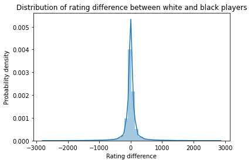

# Are chess openings equally as good in beginners and grandmaster's hands?

### [Home](https://morgant-ds.github.io) > [Projects](https://morgant-ds.github.io/data-science-projects) > [Chess data analysis](https://morgant-ds.github.io/data-science-projects/chess-data-analysis)
---------------------------------------

## **Part 1** - Finishing the dataset

all games from players in our cleared list

check distribution of delta_elo, then formulate a strategy for sampling our network of players

do the graph sampling and populate our Players_all and Games tables

### Gathering the games from players we already have information about


```python
#Grab back our clean data about players
import mysql.connector
import pandas as pd

def sql_connect():
    #Create connection to the database
    try:
        conn = mysql.connector.connect(host='localhost',
                                      database = 'chess_project',
                                      user = 'dfuu',
                                      password = 'p@s8my_SQL')
        cursor = conn.cursor()
    except:
        print("Couldn't connect to database")
        raise
    return conn, cursor

def sql_dc(co, cu):
    cu.close()
    co.close()
    return

conn, cursor = sql_connect()
players_all_df = pd.read_sql('SELECT * FROM Players_all', con = conn)
sql_dc(conn, cursor)

players_all_df.tail()
```


<div>
<style scoped>
    .dataframe tbody tr th:only-of-type {
        vertical-align: middle;
    }

    .dataframe tbody tr th {
        vertical-align: top;
    }

    .dataframe thead th {
        text-align: right;
    }
</style>
<table border="1" class="dataframe">
  <thead>
    <tr style="text-align: right;">
      <th></th>
      <th>player_id</th>
      <th>player_name</th>
      <th>title</th>
      <th>fide</th>
      <th>blitz_elo_last</th>
      <th>blitz_n_games</th>
      <th>bullet_elo_last</th>
      <th>bullet_n_games</th>
      <th>last_updated</th>
      <th>archives</th>
    </tr>
  </thead>
  <tbody>
    <tr>
      <th>5001</th>
      <td>8683</td>
      <td>viuvanegra</td>
      <td>WCM</td>
      <td>NaN</td>
      <td>1921.0</td>
      <td>3790.0</td>
      <td>NaN</td>
      <td>NaN</td>
      <td>202008</td>
      <td>['/202008', '/202007', '/202006', '/202005', '...</td>
    </tr>
    <tr>
      <th>5002</th>
      <td>8685</td>
      <td>walijah27</td>
      <td>WCM</td>
      <td>1755.0</td>
      <td>1804.0</td>
      <td>434.0</td>
      <td>NaN</td>
      <td>NaN</td>
      <td>202008</td>
      <td>['/202008', '/202007', '/202006', '/202005', '...</td>
    </tr>
    <tr>
      <th>5003</th>
      <td>8687</td>
      <td>wcmariel</td>
      <td>WCM</td>
      <td>NaN</td>
      <td>1316.0</td>
      <td>284.0</td>
      <td>NaN</td>
      <td>NaN</td>
      <td>202008</td>
      <td>['/202008', '/202007', '/202006', '/201903', '...</td>
    </tr>
    <tr>
      <th>5004</th>
      <td>8689</td>
      <td>wcmsayunigihansa</td>
      <td>WCM</td>
      <td>NaN</td>
      <td>1712.0</td>
      <td>379.0</td>
      <td>1700.0</td>
      <td>119.0</td>
      <td>202008</td>
      <td>['/202008', '/202006', '/202005', '/202003', '...</td>
    </tr>
    <tr>
      <th>5005</th>
      <td>8693</td>
      <td>wonderchampion</td>
      <td>WCM</td>
      <td>NaN</td>
      <td>1980.0</td>
      <td>272.0</td>
      <td>NaN</td>
      <td>NaN</td>
      <td>202008</td>
      <td>['/202008', '/202007', '/202006', '/202005', '...</td>
    </tr>
  </tbody>
</table>
</div>


We just reused a snippet of code from last part, not much to say.

It will now be time to start gathering all the games played by our players during a certain time-frame. In order to avoid getting too much overflowed, we'll stick to 3 months worth of games: june, july and august.


```python
import pandas as pd
import re

def pgn_parser(pgn):
    """Function to extract information from the PGN entry
    Grabbing the result of the game, the ECO code of the opening
    and the cleaned up movelist"""
    
    #Using Regular Expressions to extract directly the ECO code of the opening and the result of the game
        #Making the RE patterns
    ECO_filter = re.compile(r'(?<=\[ECO \").*(?="\])')
    Result_filter = re.compile(r'(?<=\[Result \").*(?="\])')
    
        #Extracting the information
    eco = [re.search(ECO_filter, pgn).group(0)]
    result = [re.search(Result_filter, pgn).group(0)]

        #Getting the movelist, several transformations
    pgn = re.sub(re.compile(r'\n*'), "", pgn)        #Removing newlines
    bracket_filter = re.compile(r'[\(\[].*?[\)\]]')       #Removing [] and()
    pgn = re.sub(bracket_filter, "", pgn)
    bracket_filter = re.compile(r'\{.*?\}')               #Removing {}
    pgn = re.sub(bracket_filter, "", pgn)
    dot_filter = re.compile(r'\. ')                       #Removing extra space between move numbers and move
    pgn = re.sub(dot_filter, ".", pgn)[:-5]               #Removing the result from the end of the movelist
    return result, [pgn[:-5]], eco
```


```python
import requests
import json
from sqlalchemy import create_engine

engine = create_engine('mysql+mysqlconnector://dfuu:p@s8my_SQL@localhost:3306/chess_project', echo=False)

#creating our dictionary to translate the time controls into the time categories
time_controls_dict = {'5': 'bullet',
                    '10': 'bullet',
                    '10+1': 'bullet',
                    '10+5': 'bullet',
                    '20': 'bullet',
                    '30': 'bullet',
                    '60': 'bullet',
                    '60+1': 'bullet',
                    '90': 'bullet',
                    '120': 'bullet',
                    '120+1': 'bullet',
                    '180': 'blitz',
                    '180+1': 'blitz',
                    '180+2': 'blitz',
                    '300': 'blitz',
                    '300+2': 'blitz'}

dates_to_gather = ['202007', '202008']
#Preparing counters for the advancement display
total_players, curr_player = players_all_df.player_name.count(), 0

for index, row in players_all_df.iterrows(): 
    curr_player += 1                            #Increment the player count for the advancement display
    for d in dates_to_gather:
        if d in row.archives:
            #protecting the whole process in order to not stop the download in case of a problem
            try:
                api_url = 'https://api.chess.com/pub/player/{}/games/{}/{}'.format(row.player_name, d[:4], d[4:])
                gamelist = requests.get(api_url).json()
                for game in gamelist['games']:
                    #Constructing the table entry
                    entry = {}
                    try:
                        entry['time_control'] = [time_controls_dict[game['time_control']]]
                    except:
                        #If not a bullet or blitz we'll save the value as-is in case we'll need it
                        #for another analysis later
                        entry['time_control'] = [game['time_control']]  
                    try:
                        entry['white_player'] = [game["white"]["username"]]
                    except:
                        entry['white_player'] =  None
                    try:
                        entry['white_rating'] = [int(game["white"]["rating"])]
                    except:
                        entry['white_rating'] = None
                    try:
                        entry['black_player'] = [game["black"]["username"]]
                    except:
                        entry['black_player'] = None
                    try:
                        entry['black_rating'] = [int(game["black"]["rating"])]
                    except:
                        entry['black_rating'] = None
                    try:
                        entry['rules'] = [game['rules']]
                    except:
                        entry['rules'] = None
                    try:
                        entry['result'], entry['moves'], entry['eco'] = pgn_parser(game['pgn'])
                    except:
                        entry['result'], entry['moves'], entry['eco'] = None, None, None
                
                    #Pushing the game entry directly inside our MySQL database
                    entry = pd.DataFrame(entry, columns=entry.keys())
                    conn, cursor = sql_connect()
                    entry.to_sql(name='Games', con=engine, if_exists='append', index=True)
                    sql_dc(conn, cursor)
            except:
                pass
        #Displaying an advancement of the games downloading process, since it's quite long
        conn, cursor = sql_connect()
        downloaded_games = pd.read_sql('SELECT COUNT(*) FROM Games;', con=conn).sum(axis=0)
        print('Number of games donwloaded: {} | Player n°{}/{}'.format(downloaded_games['COUNT(*)']
                                                                      ,curr_player, total_players), end='\r')
        sql_dc(conn, cursor)

print('\nDownload completed')
```

    Number of games donwloaded: 847707 | Player n°5006/5006
    Download completed


```python

```

Alright, we successfully gathered all games played by our players during three full months. The next step well be to find other players of other ratings in order to populate our database with games and players representing almost the whole spectrum of level of play, ideally down to 900 rating. We arbitrarily decide that 900 rating will be our base. Of course there are players with less rating, however empirically 900 rating is approximately the rating of a total beginner who took to take the game seriously for a few weeks.

### Populating our database: a graph sampling problem

We currently have information about players in the 2000-3000 range. This means we need to get information about players sitting in different rating realms, down to 900. But, as any statistician knows, how a population is sampled can make or break an analysis! These are the simplest approaches I thought about, but we'll have to choose wisely:

- The chess.com api gives access to "clubs" and "groups", which players can join. We could then simply choose a few clubs or groups and gather their members similarly to how we gathered the titled players. It appears that a lot of these clubs or groups are themed around either a specific opening or specific areas of the game. I have no trust that these groups can be representative of the whole population of players, especially as we don't know how much of the player population actually is involved into groups or clubs (I played on this site during close to ten years and never was interested in those, it that means anything at all). I am not sure about how to even check how representative such a sample would be, and this would have to be done, so I decided against this approach.

- The chess.com api also gives access to online tournaments that have been played, with easy access to both the games and the players who enrolled. Not only do tournaments suffer from similar pitfalls to the above point, but many players enroll in tournament and retire from it after a few minutes. I have absolutely no trust in the sampling we could get from this approach. 

- A slightly more complicated approach is to grab the opponents of the players we already have in our database, and keep doing so iteratively. This turns our problem into a simple graph traversal one, and to choose which algorithm to use we first need to make educated asumptions about the nature of the graph (with players as nodes connected by edges representing the games they played together). This approach has the merit of having allowing us to estimate how representative our sample population will be, as well as presents other advantages. This is the approach I chose, and will discuss it in more details thereafter.

#### Topology of a chess players network

In order to understand how our network is shaped, we'll look into the rating differences in the games played:  

```python
#Load the dataset
import mysql.connector
import numpy as np
import pandas as pd

def sql_connect():
    #Create connection to the database
    try:
        conn = mysql.connector.connect(host='localhost',
                                      database = 'chess_project',
                                      user = 'user',
                                      password = 'password')
        cursor = conn.cursor()
    except:
        print("Couldn't connect to database")
        raise
    return conn, cursor

def sql_dc(co, cu):
    cu.close()
    co.close()
    return

conn, cursor = sql_connect()
games_df = pd.read_sql('SELECT * FROM Games', con = conn)
sql_dc(conn, cursor)

#Adding the corresponding column to the games dataframe and calculate the rating difference
games_df['elo_diff'] = games_df.apply( lambda row: row.white_rating - row.black_rating, axis=1)

#Plot the distribution
import matplotlib.pyplot as plt
import seaborn as sn
%matplotlib inline

fig = sn.distplot(a = games_df.elo_diff, kde=True)
plt.title('Distribution of rating difference between white and black players')
plt.xlabel('Rating difference')
plt.ylabel('Probability density')
#plt.xlim(-1000, 1000)
```  




It is very clear from the above figure that players tend to play with other players of similar strength. This behavior is a direct consequence of the matching algorithm: when a player searches a game, the algorithm will first look for another player with a very similar rating, and then if no match is found it will gradually loosen the rating similarity. This is of course a voluntary feature of the matching system: games are more enjoyable to play against an opponent of similar skill level. Still, it is an important asumption for how we'll implement our graph sampling method, so we had to check this.  
If we consider the graph where the players are the nodes and the games between them the edges as the connectivity graph, what this distribution means is that players tend to be connected mostly with other players of similar rating. Here's a visual representation of that graph.

*graph figure, + schematic traversal direction*

Therefore, given that we started with titled players, we actually only have information about one part of that graph, and have close to zero information about the right side of it. If we want to populate our database with games of all skill levels, we will need to find a way to travel towards the right.
+ With visual representation of our ideal graph traversal method

### Choosing a relevant graph traversal algorithm

Now I narrowed down conceptually our problem, I have to choose a practical approach. I know we treat this network as a graph with a specific structure and I need to decide which graph traversal algorithm to use and how to implement it. It will therefore be briefly discussed before showing the code and actual implementation.

#### Which algorithm to choose?
Depth first? Breadth first? Forest fire? Other?
*With link to the graph sampling review*

#### Sample over the nodes or the edges?

The players we want in our database are active players. If we sample uniformly over the players, active and inactive players have an equal chance of being picked. However by sampling uniformly over games played, the players' chance of being picked becomes proportional to their number of games played, thus statistically favoring active players. And especially as our game database consists of recent games whereas our list of players consists of all-time titled players, sampling over the games will give us more chances of getting recently active players meaning more games to populate our database since we only download the games from the last two full months.  
I will therefore sample over the games in our database.

### Implementation of the "blablabla" graph traversal algorithm


```python

```

Quick verification of what we gathered

## Conclusion

I was able to implement a graph sampling strategy based off a graph traversal algorithm. Some interesting have been discussed about how to choose such a strategy to explore a network, and most importantly all the data I needed to gather have been gathered.  
The exploitation of this dataset will be discussed in [**part 2**](data-chess-openings-analysis.md).
